# CoreStack-STACD Airflow Docker — Run Guide

**Image:** `saharshlaud/corestack-stacd-airflow:latest`  
**DockerHub:** https://hub.docker.com/r/saharshlaud/corestack-stacd-airflow  
**Airflow Version:** 2.10.4 | **Base OS:** Ubuntu 24.04 | **Python:** 3.12

---

## Prerequisites

- Docker installed and running on your system
- For WSL (Windows): Docker Desktop or Docker Engine installed inside WSL
- Verify Docker is working:

```bash
docker --version
docker ps
```

---

## Step 1 — Pull the Image from DockerHub

```bash
docker pull saharshlaud/corestack-stacd-airflow:latest
```

This downloads the pre-built image (~347 MB compressed) containing:
- Python 3.12 virtual environment (auto-activated on login)
- Apache Airflow 2.10.4 with SequentialExecutor
- STACD custom plugin (Initialize Workflow, Delete DAG)
- STACD core package (database, dag_generator, stac_export)
- Pre-seeded `admin` / `admin` login

Verify the image downloaded:
```bash
docker images
```

---

## Step 2 — Run the Container

```bash
docker run -it \
  --name corestack-stacd-airflow \
  -p 8080:8080 \
  saharshlaud/corestack-stacd-airflow:latest
```

**What each flag does:**

| Flag | Purpose |
|------|---------|
| `-it` | Interactive mode — drops you into a shell inside the container |
| `--name corestack-stacd-airflow` | Names the container for easy reference |
| `-p 8080:8080` | Maps port 8080 on your machine to port 8080 inside the container |

You will land directly inside the container at `/opt/airflow` with the venv already active — the prompt will show `(venv) root@<container-id>:/opt/airflow#`.

---

## Step 3 — Start Airflow Inside the Container

Once inside the container, run:

```bash
airflow standalone
```

This starts three processes together:
- **Webserver** — serves the Airflow UI at port 8080
- **Scheduler** — watches the `dags/` folder and triggers runs
- **Triggerer** — handles async tasks

Wait for this line to appear in the logs:

```
standalone | Airflow is ready
```

**Container started and `airflow standalone` running:**

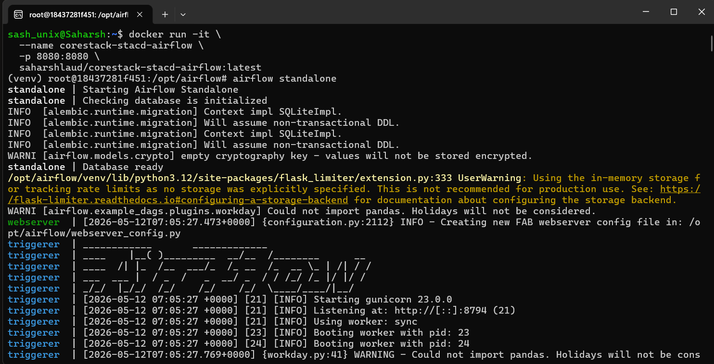

---

## Step 4 — Open the Airflow Dashboard

Open your browser and go to:

```
http://localhost:8080
```

Login with:
- **Username:** `admin`
- **Password:** `admin`

**Airflow dashboard after login, STACD menu visible in top nav:**

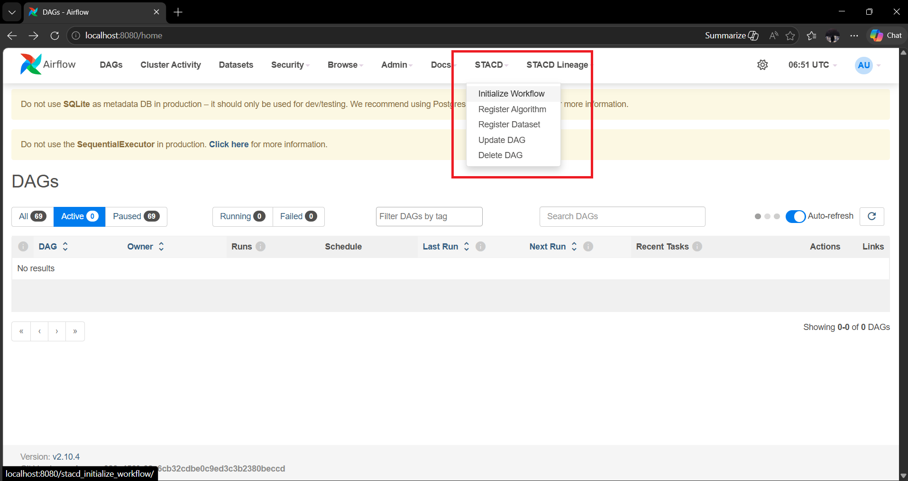

---

## Step 5 — Initialize Workflow (Upload YAML Files)

Click **STACD → Initialize Workflow** in the top navigation bar.

You will see the Upload Workflow Configuration form with 3 file inputs:

1. **DAG YAML** — DAG structure with Algorithm Type and Dataset Type definitions  
   *(e.g., `stacd_dag_consolidated.yaml`)*
2. **Algorithm Repository YAML** — Algorithm Instance definitions with API endpoints  
   *(e.g., `corestack_lite_algorithm_repo_full.yaml`)*
3. **Dataset Repository YAML** — Root/pre-existing dataset definitions  
   *(e.g., `corestack_lite_dataset_repo.yaml`)*

Select all three files using the file choosers, then click **Initialize Workflow**.

**Selecting the YAML files:**

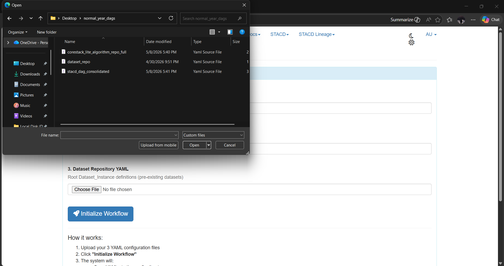

**Initialize Workflow form with files selected:**

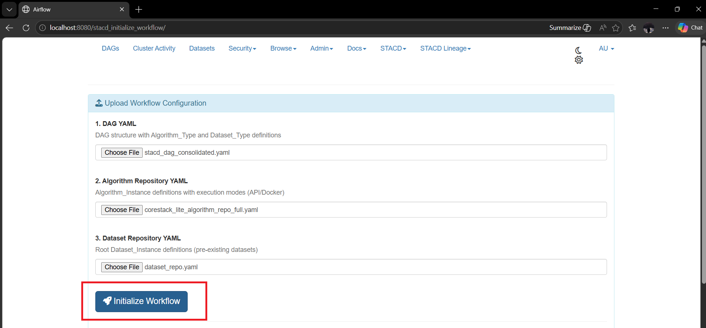

---

## Step 6 — Workflow Initialized

After clicking Initialize Workflow, the system will:
- Parse all 3 YAML files
- Write DAG, Algorithm, and Dataset records to `stacd_database.db`
- Generate a DAG Python file and deploy it to `dags/`

A success message will appear at the top of the page confirming the database was initialized and the DAG script was deployed to Airflow.

**Workflow initialized success message:**

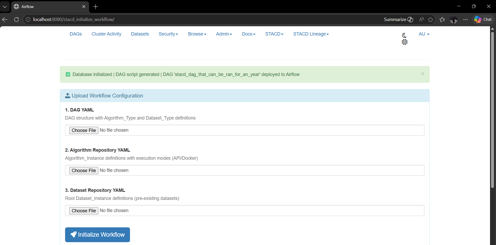

You can also verify in the container terminal — the webserver logs will show:

```
✓ Workflow initialization complete!
DAG ID: stacd_dag_that_can_be_ran_for_an_year
Algorithms: AdminBoundary, NREGAClip, MWSLayer, ...
SUCCESS: Database initialized | DAG script generated | DAG deployed to Airflow
```

**CLI confirmation in terminal:**

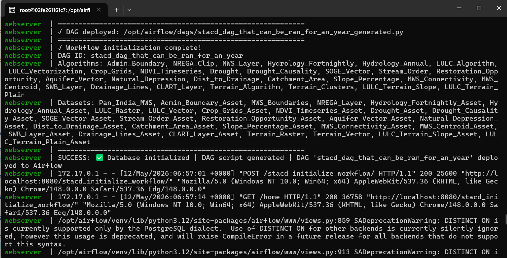

---

## Step 7 — DAG Appears in Dashboard

The newly generated DAG will appear in the DAGs list after the scheduler picks it up.

> **Note:** In standalone mode, the scheduler may take a few minutes to detect the new DAG file. To see it immediately, press `Ctrl+C` to stop Airflow and run `airflow standalone` again.

**DAG visible in the Airflow DAGs list:**

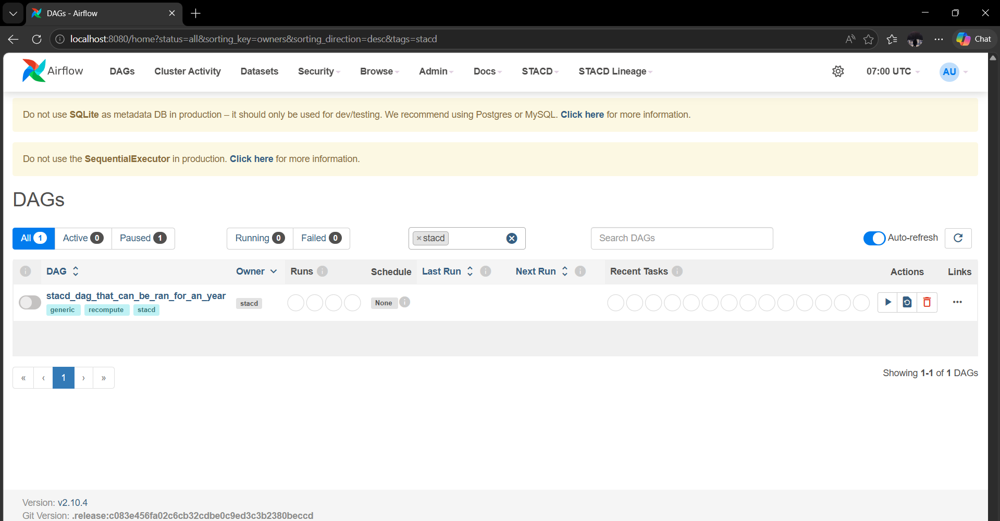

---

## Step 8 — Trigger the DAG

Click on the DAG name to open it. On the top-right corner, click the **Trigger DAG** button (▶ icon).

**DAG detail view with Trigger DAG button:**

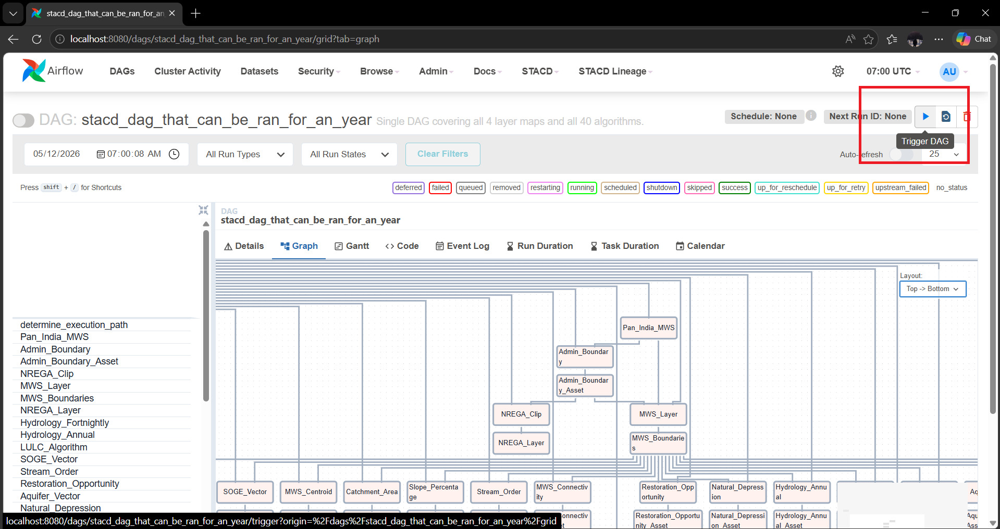

---

## Step 9 — Provide DAG Parameters

A parameters form will appear. Fill in the required fields:

| Parameter | Example Value | Description |
|-----------|--------------|-------------|
| `state` | `Karnataka` | State name |
| `district` | `Mysuru` | District name |
| `block` | `Mysuru` | Block name |
| `start_year` | `2017` | Start year for analysis |
| `end_year` | `2018` | End year for analysis |
| `geo_amount_id` | `1` | GEO amount ID |
| `execution_type` | `generic` | Execution type |

Click **Trigger** to start the DAG run.

**DAG parameters form:**

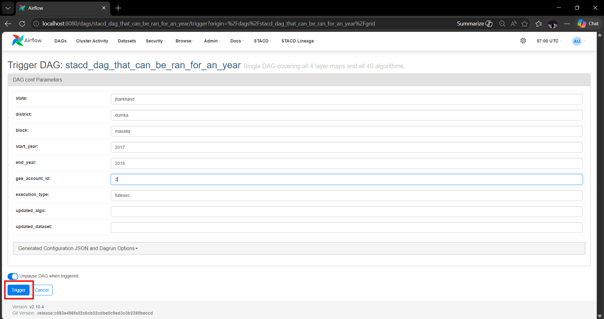

---

## Step 10 — Monitor DAG Progress

After triggering, you will be redirected back to the DAG view. The run status shows as **running** and individual task nodes update their colour as they complete:

- 🟡 **Queued** — waiting to run
- 🟢 **Running** — currently executing
- ✅ **Success** — completed successfully
- ❌ **Failed** — task failed

**DAG run in progress, tasks running:**

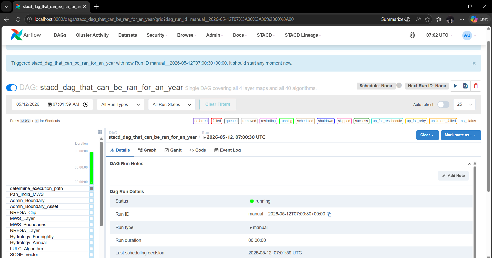

---

## Step 11 — Inspect Task Logs

Click on any individual task node in the graph view, then click **Logs** to see the full execution log for that task.

Useful for debugging — logs show the algorithm's API call, GEE asset output, and any errors.

**Task log view for a specific node:**

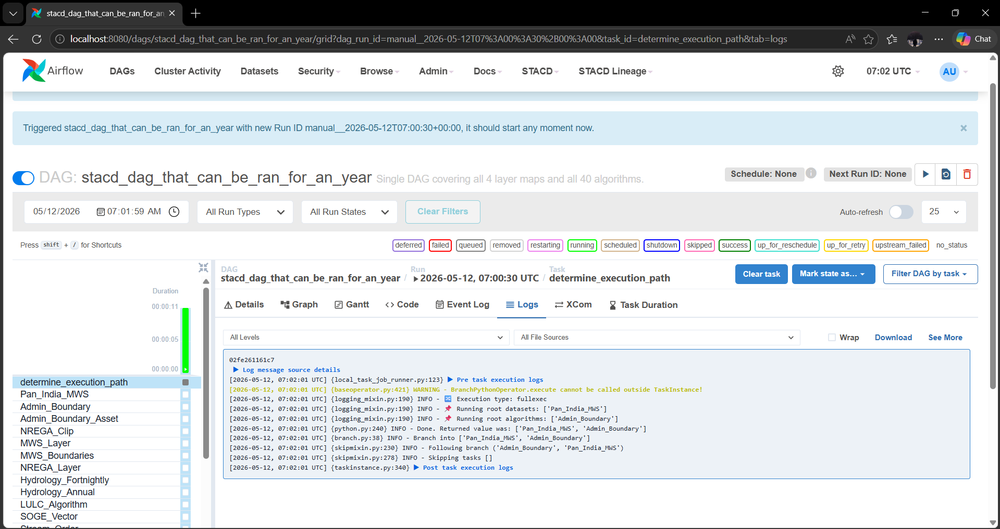

---

## Container Management Commands

### Stop the container
Press `Ctrl+C` inside the container terminal to stop Airflow, then type `exit` to leave the container.

From outside the container:
```bash
docker stop corestack-stacd-airflow
```

### Start again (container already exists)
```bash
docker start corestack-stacd-airflow
docker exec -it corestack-stacd-airflow /bin/bash
# Then inside:
airflow standalone
```

### Remove the container entirely
```bash
docker stop corestack-stacd-airflow
docker rm corestack-stacd-airflow
```

### Inspect files inside the container
```bash
docker exec -it corestack-stacd-airflow /bin/bash
ls /opt/airflow/plugins/    # STACD plugin files
ls /opt/airflow/stacd/      # STACD core package
ls /opt/airflow/dags/       # Generated DAG files
```

### Copy the STACD database out for inspection
```bash
docker cp corestack-stacd-airflow:/opt/airflow/stacd/database/stacd_database.db ./stacd_database.db
```

Then view it in a browser using sqlite-web:
```bash
docker run -it --rm \
  -p 8081:8080 \
  -v $(pwd):/data \
  ghcr.io/coleifer/sqlite-web:latest \
  /data/stacd_database.db
```

Open **http://localhost:8081** to browse all STACD tables.

---

## Troubleshooting

| Issue | Cause | Fix |
|-------|-------|-----|
| `port is already in use` | Something else running on 8080 | Change `-p 8081:8080` and visit `localhost:8081` |
| `container name already in use` | Old container still exists | Run `docker rm corestack-stacd-airflow` first |
| DAG not appearing after initialize | Scheduler hasn't picked it up yet | Restart `airflow standalone` inside the container |
| Login fails with `admin/admin` | DB from a previous run has a different password | `docker rm` the container and `docker run` fresh |
| `airflow: command not found` | venv not active | Run `source /opt/airflow/venv/bin/activate` first |

